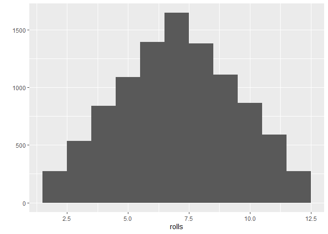
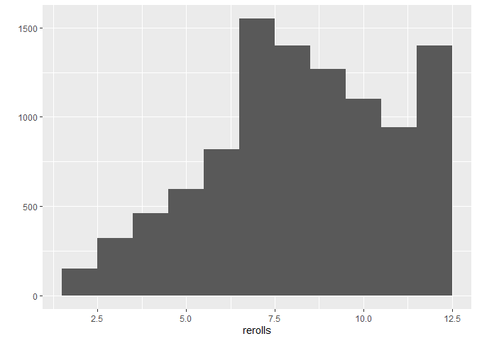

Dice
================
Jon Powell
18/07/2020

First install some packages. It may be worth creating a source, script,
with frequently used packages in the future but until that time manually
install what you need first

    ## -- Attaching packages --------------------------------------------------------------------------------------- tidyverse 1.3.0 --

    ## v ggplot2 3.3.2     v purrr   0.3.4
    ## v tibble  3.0.1     v dplyr   1.0.0
    ## v tidyr   1.1.0     v stringr 1.4.0
    ## v readr   1.3.1     v forcats 0.5.0

    ## -- Conflicts ------------------------------------------------------------------------------------------ tidyverse_conflicts() --
    ## x dplyr::filter() masks stats::filter()
    ## x dplyr::lag()    masks stats::lag()

    ## here() starts at C:/Users/jonmp/OneDrive/Documents/Projects/hopwithR

Creating a dice starting with a vector of numbers (1:6)

``` r
die <- 1:6

#standard element-wise mulitplcation (this means shorter vectors will be recyled in order to produce results if vectors are of uneven lengths)
die * die
```

    ## [1]  1  4  9 16 25 36

``` r
#For traditional matrix based inner multiplicaiton use "%*%"
die %*% die
```

    ##      [,1]
    ## [1,]   91

``` r
#For traditional matrix based outer multiplication use "%o%"
die %o% die
```

    ##      [,1] [,2] [,3] [,4] [,5] [,6]
    ## [1,]    1    2    3    4    5    6
    ## [2,]    2    4    6    8   10   12
    ## [3,]    3    6    9   12   15   18
    ## [4,]    4    8   12   16   20   24
    ## [5,]    5   10   15   20   25   30
    ## [6,]    6   12   18   24   30   36

First a little bit about functions If in doubt use args(function) to see
what the arguments in a given function are i.e. args(round)

``` r
# sample twice from the vector die but is there replacement? NO!
sample(x = die, size = 2)
```

    ## [1] 5 2

``` r
args(sample)
```

    ## function (x, size, replace = FALSE, prob = NULL) 
    ## NULL

``` r
sample(x = die, size = 2, replace = TRUE)
```

    ## [1] 2 4

``` r
roll <- function(){
  die <- 1:6
  dice <- sample(die, size = 2, replace = TRUE)
  sum(dice)
}

roll2 <- function(bones = 1:6){
  dice <- sample(bones, size = 2, replace = TRUE)
  sum(dice)
  
}
```

The project creates at set of wieghted dice

``` r
replicate(10, roll())
```

    ##  [1]  8  5  4 11  5  6  6  9  8 11

``` r
rolls <- replicate(10000, roll())
qplot(rolls, binwidth = 1)
```

<!-- -->

``` r
reroll <- function(m = 1:6){
  dice <- sample(m, size = 2, replace = TRUE,
                 prob = c(1/8, 1/8, 1/8, 1/8, 1/8, 3/8))
  sum(dice)
}

rerolls <-  replicate(10000, reroll())
qplot(rerolls, binwidth = 1)
```

<!-- -->
